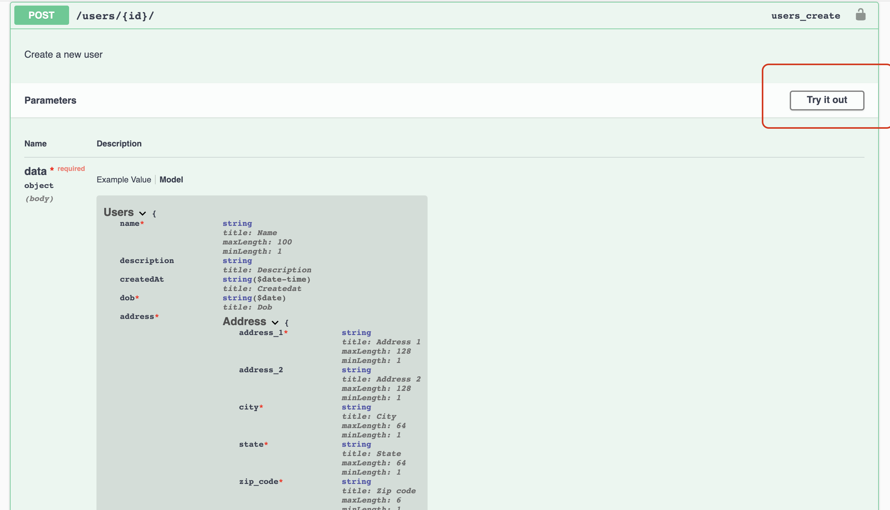
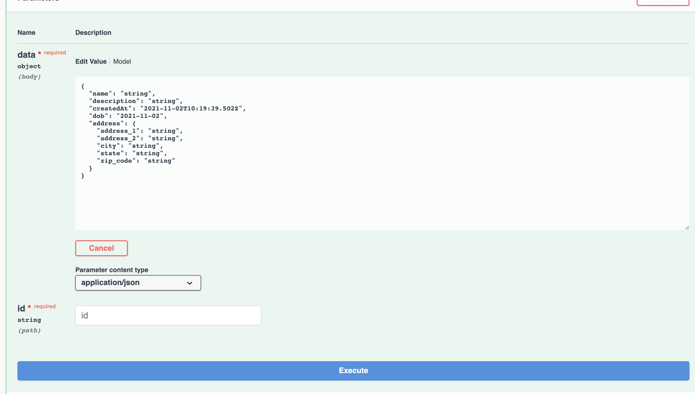
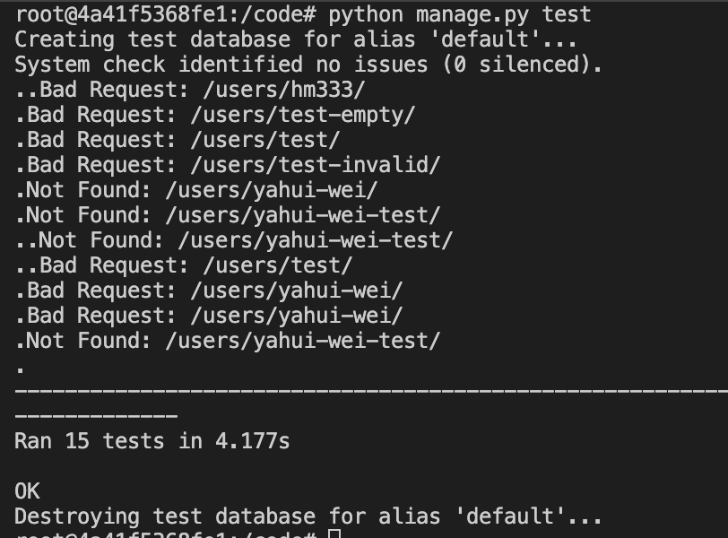

# ryde-backend-challenge

## Prerequisites

This project is run fully based on docker and docker-compose.

Please install docker at `https://docs.docker.com/install/` and docker-compose at `https://docs.docker.com/compose/install/`.

## Running the Project

1. Copy the `.env.example` file available and create an `.env` file at the same directory. Update the fields accordingly for secret data.
2. `docker-compose --env-file .env config`

   * This command will configure the `docker-compose.yml` by taking in the environment variables stated in `.env`
   * Note: please ensure to install docker-compose version 1.8+ for the config to work properly
3. `docker-compose up`

   1. This will start the process of building the backend image from the source Python 3.6 base image, and installing pip packages stated inside the `requirements.txt` file.

      - Please refer to `Dockerfile` for more details.
      - All codes will be mounted as a volume inside the `/code` directory.
   2. A MongoDB base image will also be pulled from the docker registry.

      * All data will be stored in the `/data/db` directory inside the mongodb image, while in the project directory itself, you can see them inside `./db` folder
   3. After building the image, the processes will be started as stated in the `docker-compose.yml` file.

      * Upon starting up, a data migration will be carried out based on the migrations stated inside the `migrations` folder.
4. Visit APIs documentation at `localhost:8000/swagger/`
5. To list running docker containers, you can run `docker ps`, note the container id stated in the output.
6. To execute commands inside the image, you can run `docker exec -it <container_id> bash` then run whatever commands you need.

   If you would like to run the test cases, run `python manage.py test` after getting into the backend image.
7. If you need to use the mongodb, the port 27017 is left open. You can access by `mongo -u <your_username> -p <your_password>`

## The Tech Stack

1. This project uses Django-Rest-Framework to deploy REST API.
2. The database used is MongoDB. To connect between Django ORM and MongoDB, a connector  [`djongo`](https://github.com/nesdis/djongo) is used.
3. `drf-yasg` is used to run Swagger for API documentation.

## Django Project Directory
- The Django project resides inside the `./ryde` directory.
- `./ryde/ryde` folder stores the project settings, urls, and other configurations. 
- `./ryde/users` folder stores the application which includes everything related to the Users feature. 
    - The models inside `models.py` is the object relational mapping of the MongoDB collections. The configurations such as `allow_blank`, `primary_key` are set inside this file. 
    - The serializers inside `serializers.py` is used for validation of the input and output format before calling the CRUD methods on the MongoDB. 
    - `urls.py` store the REST API endpoints available. 
    - `views.py` is an implementation of the business logic to receive request data and process accordingly before sending it to the model layer. 
    - `migrations` folder stores the instructions to change the models in the database 

## The Project Scope

This project only implements one very basic django app, which is a user model stored in a MongoDB database.

The user data is stored in the following structure:

```json

        {
            "id": "<user_id>",  
            "name": "<user_name>", 
            "description": "<some_description>",
            "dob": "<dob_in_YYYY-MM-dd_format>", 
            "address": {
                    "address_1" : "<address_2>", 
                    "address_2": "<address_2>",
                    "city" : "<city>",  
                    "zip_code" : "<zip_code>", 
                    "state": "<state>",
            }
        }
```

The configuration of each fields are declared in the `ryde/users/models.py` file.

There are five REST APIs implemented. Please refer to `ryde/ryde/urls.py` and `ryde/users/urls.py`.

<table>
    <tr>
        <th>
            Method
        </th>
        <th>
            Endpoint
        </th>
        <th>
            Request Body
        </th>
        <th>
            Description
        </th>
    </tr>
    <tr>
        <td>
        GET
        </td>
        <td>
        /users
        </td>
        <td>
        </td>
        <td>
        View all users
        </td>
    </tr>
    <tr>
        <td>
        GET
        </td>
        <td>
        /users/< str:id >
        </td>
        <td>
        </td>
        <td>
        View user of a given user id
        </td>
    </tr>
    <tr>
        <td>
        POST
        </td>
        <td>
        /users/< str:id >
        </td>
        <td><pre lang='json'>
        {  
            "name": "<user_name>", 
            "description": "<some_description>",
            "dob": "<dob_in_YYYY-MM-dd_format>", 
            "address": {
                    "address_1" : "<address_2>", 
                    "address_2": "<address_2>",
                    "city" : "<city>",  
                    "zip_code" : "<zip_code>", 
                    "state": "<state>",
            }
        }
        </pre></td>
        <td>
        Add a new user 
        </td>
    </tr>
    <tr>
        <td>
        PUT
        </td>
        <td>
        /users/< str:id >
        </td>
        <td><pre lang='json'>
        {  
            "name": "<user_name>", 
            "description": "<some_description>",
            "dob": "<dob_in_YYYY-MM-dd_format>", 
            "address": {
                    "address_1" : "<address_2>", 
                    "address_2": "<address_2>",
                    "city" : "<city>",  
                    "zip_code" : "<zip_code>", 
                    "state": "<state>",
            }
        }
        </pre>
        </td>
        <td>
        Update data of a specific user of a given user id
        </td>
    </tr>
    <tr>
        <td>
        DELETE
        </td>
        <td>
        /users/< str:id >
        </td>
        <td>
        </td>
        <td>
        Delete data of a user of a given user id
        </td>
    </tr>
</table>

View the documentation at `localhost:8000`
1. Click on "Try it out"


2. Edit the columns and click on "execute", scroll down to see the output. 

## Tests Cases


| Endpoint | Test Name | Description | Passed? (Y/N) |
| - | - | - | - |
| GET /users | test_get_all_users | Test if API is able to retrieve a list of all users | Y |
| GET /users/[str:id](str:id)/ | tests_get_specific_user_by_id | Test if API is able to retrieve data of a specific user based on the user's id | Y |
| GET /users/[str:id](str:id)/ | tests_get_specific_user_by_id_user_not_found | Test if API is not able to retrieve data of a specific user based on the user's id if the id is invalid | Y |
| POST /user/[str:id](str:id)/ | tests_create_user | Test if API is able to create a user with valid data | Y |
| POST /user/[str:id](str:id)/ | tests_create_user_additional_invalid_fields | Test if API is giving bad request error when additional fields filled up | Y |
| POST /user/[str:id](str:id)/ | tests_create_user_invalid_data | Test if API is able to throw HTTP_400_BAD_REQUEST if required fields are unfilled or invalid | Y |
| POST /user/[str:id](str:id)/ | tests_create_user_empty | Test if API is able to throw HTTP_400_BAD_REQUEST request body is empty | Y |
| POST /user/[str:id](str:id)/ | tests_create_user_id_already_exists | Test if API is able to throw error 404 bad request if primary key (id) already existed | Y |
| PUT /users/[str:id](str:id)/ | tests_update_user | Test if API is able to update user in database when data is valid | Y |
| PUT /users/[str:id](str:id)/ | tests_update_user_data_invalid | Test if API is able to throw bad request error id data is invalid | Y |
| PUT /users/[str:id](str:id)/ | tests_update_user_data_invalid_address_field_errors | Test if API is able to throw bad request error id data in address embedded model is invalid | Y |
| PUT /users/[str:id](str:id)/ | tests_update_user_additional_invalid_fields | Test if API is giving bad request error when additional fields filled up in request body | Y |
| PUT /users/[str:id](str:id)/ | tests_update_user_user_doesnt_exist | Test if API is able to return 404 if user id is not found | Y |
| DELETE /users/[str:id](str:id)/ | tests_delete_user | Test if API is able to delete user given the user's id | Y |
| DELETE /users/[str:id](str:id)/ | tests_delete_user_user_doesnt_exist | Test if API is able to return 404 if user id is not found | Y |


You should see tests output as such when running the tests by `python manage.py test`


